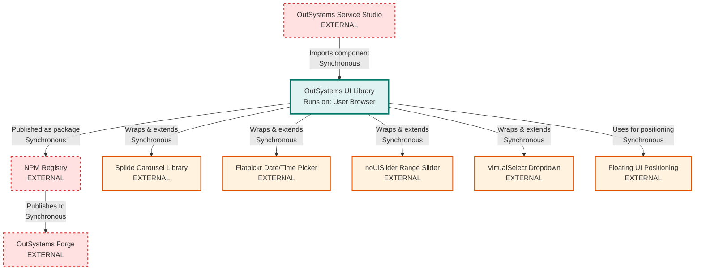

# OutSystems UI Architecture

> **Repository:** outsystems-ui
> **Runtime Environment:** User Browser (consumed by OutSystems applications)
> **Last Updated:** 2026-03-04

## Overview

OutSystems UI is a UI component library that provides TypeScript/JavaScript behaviors and CSS styles for 70+ UI patterns used in OutSystems Reactive Web and Native Mobile applications. The compiled library runs in the end user's browser and is consumed by applications built in OutSystems Service Studio.

## Architecture Diagram

## External Integrations

| External Service          | Communication Type    | Purpose                                                    |
| ------------------------- | --------------------- | ---------------------------------------------------------- |
| OutSystems Service Studio | Sync (Import)         | Design-time integration - developers drag/drop UI patterns |
| NPM Registry              | Sync (HTTP)           | Distribution channel for versioned releases                |
| OutSystems Forge          | Sync (HTTP)           | Component marketplace for OutSystems platform              |
| Splide (4.1.3)            | Sync (JavaScript API) | Carousel/slider provider implementation                    |
| Flatpickr (4.6.13)        | Sync (JavaScript API) | DatePicker, TimePicker, MonthPicker provider               |
| noUiSlider (15.8.1)       | Sync (JavaScript API) | RangeSlider provider implementation                        |
| VirtualSelect (1.1.0)     | Sync (JavaScript API) | Dropdown with search/tags provider                         |
| Floating UI (1.6.5)       | Sync (JavaScript API) | Positioning engine for Balloon/Tooltip patterns            |

## Build & Compilation

The project uses a Gulp-based build pipeline that compiles TypeScript and SCSS into platform-specific bundles:

### Compilation Targets

The build system produces separate outputs for two OutSystems platforms:

- **O11** - OutSystems 11 (traditional platform)
- **ODC** - OutSystems Developer Cloud (cloud-native platform)

**Build artifacts:**

- `O11.OutSystemsUI.js` + `O11.OutSystemsUI.css` (+ `.d.ts` for production)
- `ODC.OutSystemsUI.js` + `ODC.OutSystemsUI.css` (+ `.d.ts` for production)

### Build Process

1. **TypeScript Compilation** (`gulp/Tasks/TsTranspile.js`)
    - Compiles 363 TypeScript files from `src/scripts/`
    - Uses AMD module format (`tsconfig.json`: `"module": "amd"`)
    - Platform-specific exclusions (e.g., O11 excludes IconLibrary)
    - Replaces placeholders: `<->platformType<->`, `<->iconPlaceholderClass<->`
    - Development mode: includes sourcemaps
    - Production mode: generates `.d.ts` declaration files

2. **SCSS Compilation** (`gulp/Tasks/ScssTranspile.js`)
    - Compiles platform-specific SCSS entry points
    - `src/scss/O11.OutSystemsUI.scss` and `src/scss/ODC.OutSystemsUI.scss`
    - PostCSS plugins: discard comments, remove duplicates
    - Autoprefixer for cross-browser compatibility (last 10 versions)
    - Development mode: includes sourcemaps
    - Production mode: removes empty lines

3. **SCSS File Generation** (`gulp/Tasks/CreateScssFile.js`)
    - Dynamically generates platform-specific SCSS entry files
    - Orchestrates import order for patterns, providers, and utilities

### Development Workflow

Run `npm run dev` (or `gulp startDevelopment --target`) to:

- Clean `dist/` folder
- Compile TypeScript and SCSS in development mode
- Start BrowserSync server on port 3000
- Watch for file changes and auto-recompile
- Serve `dist/index.html` with links to compiled assets

### Production Build

Run `npm run build` to:

- Compile TypeScript and SCSS in production mode
- Run ESLint with auto-fix
- Generate TypeDoc documentation
- Output minified bundles without sourcemaps

## Architectural Tenets

### T1. Provider Pattern Isolation

The framework wraps third-party UI libraries (Splide, Flatpickr, noUiSlider, VirtualSelect) behind a provider abstraction, ensuring the public API remains stable even when switching or upgrading provider implementations.

**Evidence:**

- `src/scripts/OSFramework/OSUI/Pattern/AbstractProviderPattern.ts` (in `AbstractProviderPattern` class) - base class for patterns that delegate to providers
- `src/scripts/OSFramework/OSUI/Pattern/Carousel/CarouselFactory.ts` (in `NewCarousel` function) - factory creates provider-specific implementations based on string identifier
- `src/scripts/Providers/OSUI/Carousel/Splide/` - provider-specific implementation isolated from core pattern
- `src/scripts/OSFramework/OSUI/Event/ProviderEvents/ProviderEventsManager.ts` - manages provider event lifecycle independently

**Rationale:** Decoupling patterns from provider libraries allows upgrading or replacing providers (e.g., switching from Splide v3 to v4) without breaking the OutSystems application APIs. Developers using the framework only interact with stable `OutSystems.OSUI.Patterns.*` APIs, never with provider APIs directly.

### T2. Two-Tier Namespace Separation

The codebase maintains strict separation between internal framework code (`OSFramework.OSUI.*`) and public APIs (`OutSystems.OSUI.*`). Only public APIs are exposed to OutSystems developers.

**Evidence:**

- `src/scripts/OSFramework/` - internal implementation (patterns, behaviors, helpers, interfaces)
- `src/scripts/OutSystems/OSUI/Patterns/` - public API layer with API suffix (e.g., `AccordionAPI.ts`)
- `src/scripts/OutSystems/OSUI/Patterns/AccordionAPI.ts` (in `Create` function) - creates internal `OSFramework.OSUI.Patterns.Accordion.Accordion` instance but returns interface
- `src/scripts/osui.ts` - deprecated `osui.*` namespace redirects to `OutSystems.OSUI.*` with console warnings

**Rationale:** This separation enforces an API boundary. Internal refactoring can occur in `OSFramework.*` without breaking external consumers. The public `OutSystems.OSUI.*` API is versioned and stable, while internal implementation details can evolve. This mirrors the Facade pattern for large-scale library design.

### T3. Pattern Registry with Unique IDs

Each pattern instance is registered in a centralized Map using a unique ID. Pattern APIs operate on these IDs rather than direct object references, enabling lifetime management and preventing memory leaks.

**Evidence:**

- `src/scripts/OutSystems/OSUI/Patterns/AccordionAPI.ts` - `_accordionMap` stores pattern instances keyed by unique ID
- `src/scripts/OutSystems/OSUI/Patterns/AccordionAPI.ts` (in `Create` function) - checks if ID exists, throws error if duplicate
- `src/scripts/OutSystems/OSUI/Patterns/AccordionAPI.ts` (in `Dispose` function) - removes from map on disposal
- `src/scripts/OSFramework/OSUI/Pattern/AbstractPattern.ts` - `_uniqueId` and `_widgetId` tracked separately

**Rationale:** OutSystems applications may dynamically create/destroy UI patterns based on screen navigation and conditional rendering. The registry pattern ensures each instance can be retrieved, configured, or disposed without maintaining direct JavaScript references in platform code. The unique ID approach also prevents conflicts when multiple instances of the same pattern exist on a page.

### T4. Platform-Specific Compilation Guards

The build system conditionally excludes files and replaces placeholders at compile time based on the target platform (O11 vs ODC), ensuring each bundle contains only relevant code.

**Evidence:**

- `gulp/ProjectSpecs/DefaultSpecs.js` - `excludeFromTsTranspile.O11` specifies files excluded for O11 platform
- `gulp/ProjectSpecs/DefaultSpecs.js` - `iconPlaceholderClass` differs per platform (`ph` for O11, `placeholder-empty` for ODC)
- `gulp/Tasks/TsTranspile.js` (in `updateTsConfigFile` function) - dynamically modifies `tsconfig.json` exclude list per platform
- `gulp/Tasks/TsTranspile.js` (in `updateFwkAndPlatformInfo` function) - replaces `<->platformType<->` and `<->iconPlaceholderClass<->` tokens

**Rationale:** O11 and ODC have different runtime constraints (e.g., icon systems, API availability). Compiling separate bundles reduces bundle size and prevents shipping unnecessary polyfills or compatibility code. This is preferable to runtime platform detection, which would bloat both bundles with unused branches.

### T5. Factory Pattern for Polymorphic Construction

Patterns with multiple provider implementations use Factory functions to construct the appropriate concrete class, avoiding direct instantiation in API code.

**Evidence:**

- `src/scripts/OSFramework/OSUI/Pattern/Carousel/CarouselFactory.ts` (in `NewCarousel` function) - returns `ICarousel` interface, constructs `OSUISplide` implementation
- `src/scripts/OSFramework/OSUI/Pattern/DatePicker/DatePickerFactory.ts` (in `NewDatePicker` function) - selects Flatpickr provider, delegates to nested factory
- `src/scripts/Providers/OSUI/Datepicker/Flatpickr/FlatpickrFactory.ts` - second-level factory for mode selection (SingleDate vs RangeDate)
- `src/scripts/OSFramework/OSUI/Pattern/RangeSlider/RangeSliderFactory.ts` - similar pattern for NoUiSlider variants

**Rationale:** Factories centralize instantiation logic, making it easier to add new providers or modes without modifying API code. This follows the Open/Closed Principle: the API layer is closed to modification but open to extension via new factory branches. The pattern also ensures all instances are constructed consistently with proper configuration and validation.

## Component Architecture

### Pattern Hierarchy

Patterns follow an inheritance chain based on complexity:

1. **AbstractPattern** - Base for all patterns (Accordion, AnimatedLabel, ButtonLoading, Notification, etc.)
2. **AbstractProviderPattern** - Extends AbstractPattern, adds provider lifecycle management (Carousel, DatePicker, RangeSlider, Dropdown)
3. **AbstractParent/AbstractChild** - For parent-child relationships (Accordion→AccordionItem, Tabs→TabsHeaderItem/TabsContentItem)

### Pattern Lifecycle

1. **Create** - API constructs instance, stores in registry Map
2. **Initialize** - Calls `.build()` which:
    - Sets HTML element references
    - Configures callbacks
    - Sets A11Y properties
    - For provider patterns: instantiates provider
3. **Runtime** - Responds to API calls (ChangeProperty, method invocations)
4. **Dispose** - Cleans up events, removes from registry, destroys provider instance

### Event Management

The framework provides three event systems:

1. **DOM Events** - Managed by Listeners (BodyOnClick, WindowOnResize, ScreenOnScroll) and Observers (RTLObserver, LangObserver)
2. **Gesture Events** - Custom SwipeEvent and DragEvent for touch interactions
3. **Provider Events** - Wraps provider-specific event APIs (Splide's `on`, Flatpickr's `addEventListener`) through ProviderEventsManager

### Configuration System

Each pattern has a corresponding `*Config` class extending `AbstractConfiguration`:

- Parses JSON configuration from OutSystems platform
- Validates and stores property values
- Provides getter/setter methods for runtime updates
- Handles ExtendedClass CSS customization

### Helper Utilities

The `OSFramework.OSUI.Helper` namespace provides shared utilities:

- **Dom** - DOM manipulation, CSS class management, element queries
- **Dates/Times** - Date/time parsing and formatting
- **Device** - Device type detection, platform checks
- **Language** - Locale handling for internationalization
- **Sanitize** - Input sanitization for XSS prevention
- **AsyncInvocation** - Deferred callback execution

### Compilation Artifacts

Production build generates:

- **JavaScript** - Single concatenated AMD module per platform
- **CSS** - Compiled SCSS with autoprefixer applied
- **TypeScript Declarations** - `.d.ts` files for TypeScript consumers
- **TypeDoc Documentation** - Auto-generated API reference with UML diagrams

### Distribution Channels

1. **NPM Package** - `outsystems-ui` published to registry.npmjs.org
2. **OutSystems Forge** - Packaged component for Service Studio import
3. **CDN** (implied by NPM) - Bundles can be consumed via unpkg or jsdelivr

### Quality Assurance

**Automated Testing:** Separate test repository ([outsystems-ui-tests](https://github.com/OutSystems/outsystems-ui-tests)) with E2E tests using WebDriverIO and Cucumber, visual regression testing via Applitools, and cross-browser/device coverage through SauceLabs integration.

---

**Key Design Decision:** The entire framework compiles to a single JavaScript file per platform (no module splitting). This monolithic approach simplifies consumption in OutSystems applications, which import the library as a single script reference. Tree-shaking is not possible, but bundle size is controlled by excluding patterns at the platform level rather than runtime.
