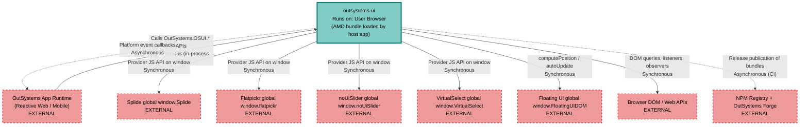

# OutSystems UI Architecture

> **Repository:** outsystems-ui
> **Runtime Environment:** User Browser (library loaded by OutSystems applications)
> **Last Updated:** 2026-08-19

## Overview

OutSystems UI is a client-side library that provides the TypeScript behaviors and CSS for 70+ UI patterns (Accordion, Carousel, DatePicker, Dropdown, Tabs, Sidebar, …) used by OutSystems Reactive Web and Native Mobile applications. It has no server component: the build produces one JavaScript bundle and one CSS bundle per platform target (O11, ODC), which the OutSystems runtime loads into the end user's browser and drives through the `OutSystems.OSUI.*` public API.

## Architecture Diagram


```mermaid
graph TB
    ThisRepo["outsystems-ui<br/>Runs on: User Browser<br/>(AMD bundle loaded by host app)"]

    HostApp["OutSystems App Runtime<br/>(Reactive Web / Mobile)<br/>EXTERNAL"]
    Splide["Splide global window.Splide<br/>EXTERNAL"]
    Flatpickr["Flatpickr global window.flatpickr<br/>EXTERNAL"]
    NoUISlider["noUiSlider global window.noUiSlider<br/>EXTERNAL"]
    VirtualSelect["VirtualSelect global window.VirtualSelect<br/>EXTERNAL"]
    FloatingUI["Floating UI global window.FloatingUIDOM<br/>EXTERNAL"]
    DOM["Browser DOM / Web APIs<br/>EXTERNAL"]
    Registry["NPM Registry + OutSystems Forge<br/>EXTERNAL"]

    HostApp -->|"Calls OutSystems.OSUI.* APIs<br/>Synchronous (in-process JS)"| ThisRepo
    ThisRepo -.->|"Platform event callbacks<br/>Asynchronous"| HostApp
    ThisRepo -->|"Provider JS API on window<br/>Synchronous"| Splide
    ThisRepo -->|"Provider JS API on window<br/>Synchronous"| Flatpickr
    ThisRepo -->|"Provider JS API on window<br/>Synchronous"| NoUISlider
    ThisRepo -->|"Provider JS API on window<br/>Synchronous"| VirtualSelect
    ThisRepo -->|"computePosition / autoUpdate<br/>Synchronous"| FloatingUI
    ThisRepo -->|"DOM queries, listeners, observers<br/>Synchronous"| DOM
    ThisRepo -.->|"Release publication of bundles<br/>Asynchronous (CI)"| Registry

    classDef thisRepo fill:#80cbc4,stroke:#00796b,stroke-width:3px,color:#000
    classDef external fill:#ef9a9a,stroke:#d32f2f,stroke-width:2px,stroke-dasharray: 5 5,color:#000

    class ThisRepo thisRepo
    class HostApp,Splide,Flatpickr,NoUISlider,VirtualSelect,FloatingUI,DOM,Registry external
```

## External Integrations

Provider libraries are **not bundled**. They are declared as browser globals in `src/scripts/Global.d.ts` (types only) and consumed at runtime via `window.*`; the host OutSystems application is responsible for loading the script. The version each provider is written against is declared in code as `ProviderInfo.Version`; `package.json` devDependencies exist only to supply typings and SCSS sources.

| External Service                | Communication Type          | Purpose                                                                             |
| ------------------------------- | --------------------------- | ----------------------------------------------------------------------------------- |
| OutSystems App Runtime          | Sync (in-process JS calls)  | Creates/configures/disposes patterns; receives callbacks for pattern events          |
| Browser DOM / Web APIs          | Sync (DOM API)              | Rendering, listeners, `MutationObserver`/`IntersectionObserver`, gestures            |
| Splide `4.1.3`                  | Sync (JS API on `window`)   | Carousel / Gallery slider provider                                                   |
| Flatpickr `4.6.13`              | Sync (JS API on `window`)   | DatePicker, MonthPicker and TimePicker provider (incl. full calendar position set)    |
| noUiSlider `15.8.1`             | Sync (JS API on `window`)   | RangeSlider provider (single and interval modes)                                     |
| VirtualSelect `1.4.0`           | Sync (JS API on `window`)   | Dropdown provider (search and tags variants)                                         |
| Floating UI DOM `1.6.5`         | Sync (JS API on `window`)   | Positioning engine behind the Balloon feature (Dropdown, Tooltip, OverflowMenu, …)   |
| OutSystems Service Studio       | Sync (design-time import)   | Developers consume patterns from the imported component                              |
| NPM Registry / OutSystems Forge | Async (release publication) | Distribution of versioned bundles (`gulp/Tasks/PrepareToDeployNpm.js`)               |

To re-check declared provider versions: `grep -rn "Version = " src/scripts/Providers --include=*.ts`.

## Compilation Boundary

The build (Gulp, see `gulp/README.md`) emits one AMD bundle plus one CSS bundle per platform target:

- `dist/O11.OutSystemsUI.js` / `.css` — OutSystems 11
- `dist/ODC.OutSystemsUI.js` / `.css` — OutSystems Developer Cloud
- `.d.ts` declarations in production mode; `dev.<target>.*` names with sourcemaps in development mode

There is no code splitting and no tree-shaking: the whole framework ships as one file, which keeps consumption in OutSystems apps a single script reference. Bundle content is trimmed at *build* time per platform (see T5), not at runtime. Commands live in [CLAUDE.md](./CLAUDE.md); setup and workflow in [CONTRIBUTING.md](./CONTRIBUTING.md).

## Layering

```
src/scripts/OSFramework/OSUI/   Internal framework: Pattern/, Feature/, Behaviors/, Event/, Helper/, Interface/, Utils/
src/scripts/OutSystems/OSUI/    Public API surface: Patterns/*API.ts, Utils/, GetVersion.ts, ErrorCodes.ts
src/scripts/Providers/OSUI/     Third-party wrappers: Carousel/Splide, Datepicker|Monthpicker|Timepicker/Flatpickr,
                                Dropdown/VirtualSelect, RangeSlider/NoUISlider, Utils/FloatingUI
```

Dependency direction is `OutSystems → OSFramework → Providers`, and the last hop is confined to factory functions (T1, T5).

## Architectural Tenets

### T1. Provider libraries must be reachable only through provider wrappers

Third-party libraries are wrapped by classes under `src/scripts/Providers/OSUI/` that extend framework abstractions, and are accessed exclusively through browser globals rather than module imports. No pattern, behavior or public API may call a provider library directly. This keeps a provider upgrade (Splide major bump, new Flatpickr option set) a change inside one directory, and keeps the library loadable even when the host app defers provider scripts.

**Evidence:**

- `src/scripts/OSFramework/OSUI/Pattern/AbstractProviderPattern.ts` (in `AbstractProviderPattern`) — provider lifecycle (`prepareConfigs`, provider instance creation/destruction) defined once for all provider-based patterns
- `src/scripts/Providers/OSUI/Carousel/Splide/Splide.ts`, `src/scripts/Providers/OSUI/Datepicker/Flatpickr/AbstractFlatpickr.ts`, `src/scripts/Providers/OSUI/Utils/FloatingUI/FloatingUI.ts` — libraries invoked as `window.Splide`, `window.flatpickr`, `window.FloatingUIDOM`
- `src/scripts/Global.d.ts` — provider types declared on `Window`, so no provider code is emitted into the bundle
- `src/scripts/OSFramework/OSUI/Event/ProviderEvents/` — provider event subscriptions normalized behind a framework manager
- `src/scripts/Providers/OSUI/SharedProviderResources/Flatpickr/Enum.ts` (in `Position`, `ProviderInfo`) — provider-specific option vocabulary and pinned version live in the provider layer

### T2. The public API layer must expose only framework interfaces and serialized responses

`OutSystems.OSUI.*` is the only surface OutSystems applications may call. It must not reference `Providers.*` types, and must return framework interfaces (never concrete provider classes). Runtime operations (property changes, method calls) must return a serialized success/error envelope instead of letting exceptions escape into platform logic; only `Create` fails loudly, since a duplicate registration is a programming error. This lets `OSFramework` be refactored freely, and lets the platform surface errors as data with stable error codes.

**Evidence:**

- `src/scripts/OutSystems/` — no references to `Providers.` anywhere in the layer (`grep -rl "Providers\." src/scripts/OutSystems` returns nothing)
- `src/scripts/OutSystems/OSUI/Utils/CreateApiResponse.ts` (in `CreateApiResponse`) — wraps every callback in try/catch and returns a JSON `{ code, isSuccess, message, value? }` string
- `src/scripts/OutSystems/OSUI/Patterns/AccordionAPI.ts` (in `ChangeProperty`, `CollapseAllItems`) — every exported function delegates through `CreateApiResponse` with an entry from `OutSystems.OSUI.ErrorCodes`
- `src/scripts/OutSystems/OSUI/Patterns/CarouselAPI.ts` (in `Create`) — returns `OSFramework.OSUI.Patterns.Carousel.ICarousel`, never the Splide wrapper type

### T3. Pattern instances must be addressed by ID through a per-pattern registry

Each `*API.ts` owns a `Map` from pattern ID to instance; the platform holds strings, not JavaScript object references. Lookups go through `Helper.MapOperation`, which resolves both `uniqueId` and `widgetId` and always returns the newest instance for a reused widget ID. Without this, page lifecycle churn in OutSystems (conditional rendering, navigation) would leave stale references and leaked DOM listeners.

**Evidence:**

- `src/scripts/OutSystems/OSUI/Patterns/AccordionAPI.ts` (`_accordionMap`, `Create`, `Dispose`) — duplicate IDs rejected on create, entry removed on dispose
- `src/scripts/OSFramework/OSUI/Helper/MapOperation.ts` (in `FindInMap`) — uniqueId/widgetId resolution and "not found" error contract
- `src/scripts/OSFramework/OSUI/Pattern/AbstractPattern.ts` (in `uniqueId`, `widgetId`, `equalsToID`) — identity kept separate from the DOM element

### T4. Every pattern must implement a symmetric, defensive build/dispose lifecycle

`AbstractPattern` declares `setHtmlElements`/`unsetHtmlElements`, `setCallbacks`/`unsetCallbacks` and `setA11YProperties` as abstract, so accessibility wiring and teardown are non-optional rather than per-pattern discretion. Teardown must tolerate a DOM that the platform already removed — patterns own their listeners and attributes, so an unguarded `dispose` breaks page navigation.

**Evidence:**

- `src/scripts/OSFramework/OSUI/Pattern/AbstractPattern.ts` — abstract `setA11YProperties`, `setCallbacks`, `setHtmlElements`, `unsetCallbacks`, `unsetHtmlElements`; `build`/`dispose`/`finishBuild` orchestration
- `src/scripts/OSFramework/OSUI/Pattern/SectionIndexItem/SectionIndexItem.ts` (in `dispose`, `_unsetTargetAttributes`) — validates target elements still exist before unsetting attributes
- `src/scripts/OSFramework/OSUI/Pattern/AbstractParent.ts`, `AbstractChild.ts` — children notify parents on removal so composite patterns (Accordion, Tabs, SectionIndex, Wizard) stay consistent
- `src/scripts/OSFramework/OSUI/Behaviors/FocusTrap.ts`, `FocusManager.ts` — shared A11Y behaviors reused instead of reimplemented per pattern

### T5. Platform differences must be resolved at build time, not by runtime branching

Files that only make sense on one platform are excluded from the TypeScript program per target, and platform-dependent literals are injected as post-compile placeholders. Both bundles therefore contain only code that can run, and patterns never carry `if (platform === …)` branches for excluded features.

**Evidence:**

- `gulp/ProjectSpecs/DefaultSpecs.js` — `excludeFromTsTranspile.O11` removes `OutSystems/OSUI/Utils/IconLibrary.ts` and `Utils/PreviewInDevices/**`; `iconPlaceholderClass` differs per target
- `gulp/Tasks/TsTranspile.js` (in `updateTsConfigFile`, `tsTranspileBasedOnPlatform`) — rewrites the `exclude` block, compiles with `--outFile` per target, then restores `tsconfig.json`
- `gulp/Tasks/TsTranspile.js` (in `updateFwkAndPlatformInfo`) — replaces the `<->platformType<->` placeholder consumed by `OSFramework.OSUI.Constants`

### T6. Concrete implementation choice must be made in factories

Patterns with more than one implementation or mode are constructed by factory functions that return interfaces. Factories are the only place in `OSFramework` allowed to name a `Providers.*` class, and a second-level factory in the provider layer selects the mode. Adding a provider or mode is therefore additive: API code and pattern consumers stay untouched.

**Evidence:**

- `src/scripts/OSFramework/OSUI/Pattern/Carousel/CarouselFactory.ts` (in `NewCarousel`) — returns `ICarousel`, instantiates `Providers.OSUI.Carousel.Splide.OSUISplide`, throws for unknown providers
- `src/scripts/OSFramework/OSUI/Pattern/DatePicker/DatePickerFactory.ts` → `src/scripts/Providers/OSUI/Datepicker/Flatpickr/FlatpickrFactory.ts` — two-level selection (provider, then SingleDate/RangeDate)
- `src/scripts/OSFramework/OSUI/Pattern/Dropdown/DropdownFactory.ts`, `RangeSlider/RangeSliderFactory.ts`, `Progress/ProgressFactory.ts` — same shape for VirtualSelect variants, noUiSlider modes and Progress types (Bar/Circle)
- `src/scripts/OSFramework/OSUI/Utils/FloatingPosition/FloatingPositionFactory.ts` — the Balloon feature obtains a positioner through a factory rather than newing up `Providers.OSUI.Utils.FloatingUI`

## Component Notes

- **Features vs. patterns:** `OSFramework/OSUI/Feature/Balloon/` is a composable capability (floating panel + positioning + focus handling) reused by Dropdown, Tooltip, OverflowMenu and pickers, rather than a pattern with its own public API.
- **Configuration flow:** the platform passes a JSON string; `*API.Create` parses it and hands it to a `*Config` class extending `AbstractConfiguration` (`AbstractProviderConfiguration` for provider patterns), which validates values and, for providers, maps them to provider options.
- **Event systems:** `Event/DOMEvents` (shared body-click, window-resize, scroll listeners plus RTL/language observers), `Event/GestureEvents` (swipe/drag), `Event/ProviderEvents` (provider event bridging). Patterns subscribe to the shared managers instead of attaching their own global listeners.
- **Quality assurance:** E2E, visual-regression and cross-browser coverage live in the separate [outsystems-ui-tests](https://github.com/OutSystems/outsystems-ui-tests) repository; this repository ships no test runner.

## Current Phase Constraints

### Deprecated `osui.*` global namespace

`src/scripts/osui.ts` keeps a thin shim that forwards legacy `osui.*` calls to `OutSystems.OSUI.*` and logs a deprecation warning. New code must not add entries to it.

> **Expires when:** all supported OutSystems platform versions call `OutSystems.OSUI.*` directly and `src/scripts/osui.ts` is deleted.
